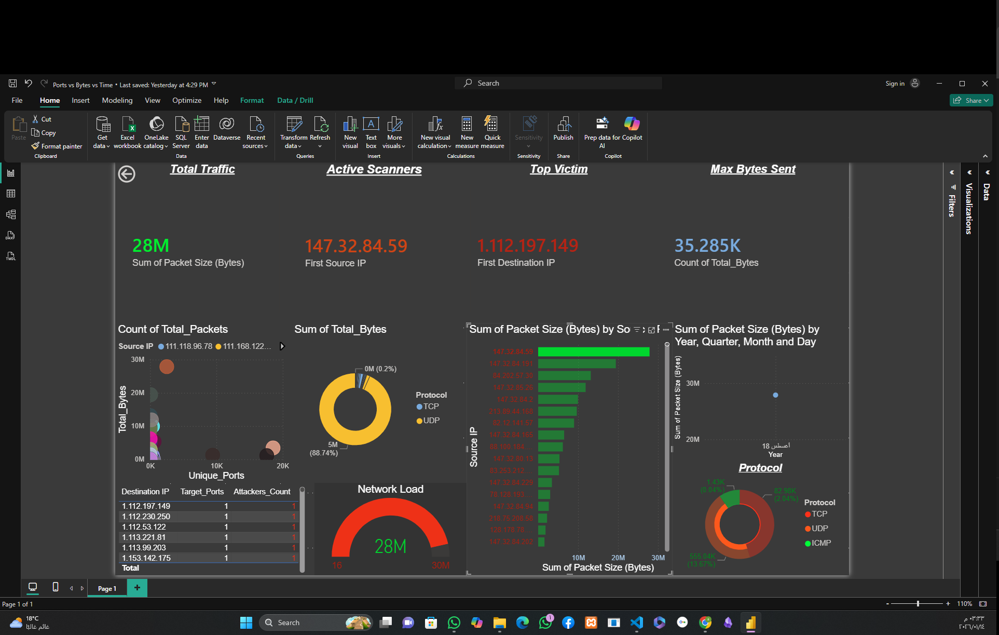

# 🔒 Botnet & DDoS Network Traffic Forensics
## SOC Incident Response & Network Forensics Case Study

**Prepared by:** Amin Mohammed Fathallah  
**Role:** SOC Analyst | Network Forensics  
**Case Type:** Timeless SOC Case Study (Public Dataset)  
**Severity Level:** 🔴 High  

---

## 📌 Case Study Disclaimer
This case study is based on a publicly available network traffic dataset and was conducted strictly for professional skill demonstration purposes.
All analysis techniques, findings, and conclusions follow real-world SOC, DFIR, and Incident Response methodologies.

---

## 🎯 Case Objective
The objective of this investigation was to analyze abnormal high-volume network traffic, identify potential **Botnet-driven DDoS behavior**, and assess the operational and security impact on the targeted victim infrastructure.

---

## 🔍 Investigation Summary
- Detected **massive traffic spikes reaching ~28 million packets** within a short time window.
- Identified **multiple distributed source IPs** targeting a single victim.
- Confirmed **multi-protocol flooding behavior** (TCP, UDP, ICMP).
- Classified the activity as a **coordinated Botnet-based DDoS attack**.
- Assessed the incident as a **high-severity availability attack**.

---

## 🛠️ Tools & Techniques
- **Traffic Processing:** Python (Pandas, NumPy)
- **Data Analysis:** Jupyter Notebook
- **Visualization:** Power BI
- **Protocols Analyzed:** TCP, UDP, ICMP
- **Methodology:** SOC Triage, Network Traffic Forensics, Incident Response

---

## 📂 Repository Contents
- 📄 **Full Forensics Report:** `DDoS_Botnet_Forensics_Report.pdf`
- 🧠 **Analysis Notebook:** `botnet_traffic_analysis.ipynb`
- 📊 **Extracted Dataset:** `traffic_stats.csv`
- 📸 **Dashboards & Visual Evidence:** `images/` directory

---

📸 **Dashboards

----

## 🚨 Key Findings
- **Peak Traffic:** ~28 million packets
- **Attack Type:** Volumetric DDoS (Botnet-driven)
- **Attack Pattern:** Distributed sources → Single victim
- **Protocols Used:** TCP, UDP, ICMP
- **Impact:** Bandwidth saturation, service degradation, potential downtime

---

## 📌 Analyst Conclusion
This case study demonstrates how **network-level telemetry and traffic behavior analysis** can be used to identify large-scale availability attacks even without payload inspection.
It highlights the importance of **Python-based automation**, **data aggregation**, and **visual analysis** in modern SOC environments.

---

## 🛡️ Recommendations
- Apply **rate limiting** and protocol-based filtering.
- Block confirmed malicious source IPs.
- Continuously monitor for traffic spikes and anomaly patterns.
- Perform forensic inspection on the targeted victim system.

